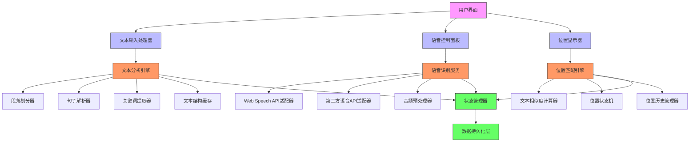
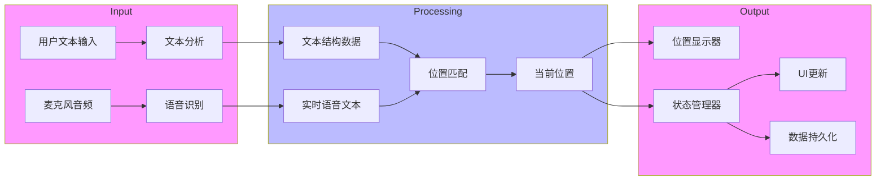
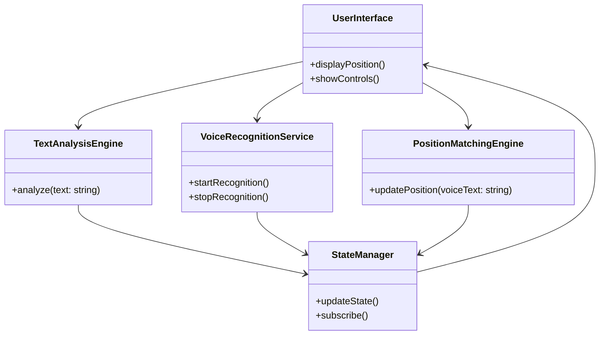

# 智能语音跟读技术架构文档

## 1. 系统架构概览

本文档详细描述了智能语音跟读功能的技术架构，包括组件设计、数据流和接口定义。

## 2. 组件架构图



## 3. 组件详细设计

### 3.1 文本分析引擎

**组件**: `TextAnalysisEngine`
**职责**: 分析输入文本并生成结构化数据

```typescript
class TextAnalysisEngine {
  private paragraphSplitter: ParagraphSplitter;
  private sentenceParser: SentenceParser;
  private keywordExtractor: KeywordExtractor;
  private cache: TextStructureCache;

  constructor() {
    this.paragraphSplitter = new ParagraphSplitter();
    this.sentenceParser = new SentenceParser();
    this.keywordExtractor = new KeywordExtractor();
    this.cache = new TextStructureCache();
  }

  async analyze(text: string): Promise<TextStructure> {
    // 检查缓存
    const cached = this.cache.get(text);
    if (cached) return cached;

    // 分析过程
    const paragraphs = this.paragraphSplitter.split(text);
    const sentences = this.sentenceParser.parse(text);
    const keywords = this.keywordExtractor.extract(text);

    const result = {
      paragraphs,
      sentences,
      keywords,
      wordCount: text.split(/\s+/).length
    };

    // 缓存结果
    this.cache.set(text, result);
    return result;
  }
}
```

### 3.2 语音识别服务

**组件**: `VoiceRecognitionService`
**职责**: 处理实时语音输入并转换为文本

```typescript
class VoiceRecognitionService {
  private primaryAdapter: SpeechRecognitionAdapter;
  private fallbackAdapter: SpeechRecognitionAdapter;
  private preprocessor: AudioPreprocessor;

  constructor() {
    this.primaryAdapter = new WebSpeechAPIAdapter();
    this.fallbackAdapter = new ThirdPartyAPIAdapter();
    this.preprocessor = new AudioPreprocessor();
  }

  async startRecognition(): Promise<Observable<string>> {
    try {
      await this.primaryAdapter.initialize();
      return this.primaryAdapter.recognize()
        .pipe(
          map(audio => this.preprocessor.process(audio)),
          catchError(err => {
            console.warn('Primary adapter failed, falling back');
            return this.fallbackAdapter.recognize();
          })
        );
    } catch (error) {
      console.error('Recognition initialization failed:', error);
      return this.fallbackAdapter.recognize();
    }
  }

  stopRecognition(): void {
    this.primaryAdapter.stop();
    this.fallbackAdapter.stop();
  }
}
```

### 3.3 位置匹配引擎

**组件**: `PositionMatchingEngine`
**职责**: 将语音文本与文本结构进行实时匹配

```typescript
class PositionMatchingEngine {
  private textSimilarity: TextSimilarityCalculator;
  private stateMachine: PositionStateMachine;
  private historyManager: PositionHistoryManager;

  constructor(textStructure: TextStructure) {
    this.textSimilarity = new TextSimilarityCalculator(textStructure);
    this.stateMachine = new PositionStateMachine(textStructure);
    this.historyManager = new PositionHistoryManager();
  }

  updatePosition(voiceText: string): PositionUpdate {
    // 计算相似度
    const similarities = this.textSimilarity.calculate(voiceText);

    // 更新状态机
    const newPosition = this.stateMachine.transition(similarities);

    // 记录历史
    this.historyManager.add(newPosition);

    return {
      position: newPosition,
      confidence: similarities.confidence,
      isJump: this.stateMachine.isJumpDetected()
    };
  }

  getCurrentPosition(): CurrentPosition {
    return this.stateMachine.getCurrentPosition();
  }
}
```

## 4. 数据流图



## 5. 接口定义

### 5.1 文本分析接口

```typescript
interface TextAnalyzer {
  /**
   * 分析文本并返回结构化数据
   * @param text 要分析的文本内容
   * @returns 结构化的文本数据
   */
  analyze(text: string): Promise<TextStructure>;

  /**
   * 清除分析缓存
   */
  clearCache(): void;

  /**
   * 获取缓存的分析结果
   * @param text 文本内容
   * @returns 缓存的结构化数据或null
   */
  getCachedAnalysis(text: string): TextStructure | null;
}
```

### 5.2 语音识别接口

```typescript
interface VoiceRecognizer {
  /**
   * 初始化语音识别服务
   */
  initialize(): Promise<void>;

  /**
   * 开始语音识别
   * @returns 实时语音文本流
   */
  recognize(): Observable<string>;

  /**
   * 停止语音识别
   */
  stop(): void;

  /**
   * 检查服务是否可用
   */
  isAvailable(): boolean;

  /**
   * 获取服务状态
   */
  getStatus(): RecognitionStatus;
}

enum RecognitionStatus {
  IDLE = 'idle',
  INITIALIZING = 'initializing',
  RUNNING = 'running',
  ERROR = 'error'
}
```

### 5.3 位置匹配接口

```typescript
interface PositionMatcher {
  /**
   * 更新当前位置根据语音输入
   * @param voiceText 语音识别的文本
   * @returns 位置更新信息
   */
  updatePosition(voiceText: string): PositionUpdate;

  /**
   * 获取当前位置
   */
  getCurrentPosition(): CurrentPosition;

  /**
   * 重置位置到开头
   */
  resetPosition(): void;

  /**
   * 手动设置位置
   * @param position 要设置的位置
   */
  setPosition(position: CurrentPosition): void;
}

interface PositionUpdate {
  position: CurrentPosition;
  confidence: number; // 0-1
  isJump: boolean; // 是否检测到跳跃
  isRepeat: boolean; // 是否检测到重复
}
```

## 6. 状态管理设计

### 6.1 状态结构

```typescript
interface VoiceTrackingState {
  // 文本结构数据
  textStructure: TextStructure | null;

  // 当前跟踪状态
  trackingStatus: TrackingStatus;

  // 当前位置
  currentPosition: CurrentPosition | null;

  // 位置历史
  positionHistory: PositionHistoryItem[];

  // 性能指标
  performance: {
    lastMatchTime: number;
    averageMatchTime: number;
    confidenceScore: number;
  };

  // 用户设置
  settings: VoiceTrackingSettings;
}

enum TrackingStatus {
  IDLE = 'idle',
  READY = 'ready',
  TRACKING = 'tracking',
  PAUSED = 'paused',
  ERROR = 'error'
}
```

### 6.2 状态管理器

```typescript
class VoiceTrackingStateManager {
  private state: VoiceTrackingState;
  private subscribers: ((state: VoiceTrackingState) => void)[];

  constructor() {
    this.state = this.getInitialState();
    this.subscribers = [];
  }

  private getInitialState(): VoiceTrackingState {
    return {
      textStructure: null,
      trackingStatus: TrackingStatus.IDLE,
      currentPosition: null,
      positionHistory: [],
      performance: {
        lastMatchTime: 0,
        averageMatchTime: 0,
        confidenceScore: 0
      },
      settings: this.loadSettings()
    };
  }

  subscribe(callback: (state: VoiceTrackingState) => void): () => void {
    this.subscribers.push(callback);
    return () => {
      this.subscribers = this.subscribers.filter(cb => cb !== callback);
    };
  }

  updateState(updater: (prev: VoiceTrackingState) => VoiceTrackingState): void {
    this.state = updater(this.state);
    this.notifySubscribers();
    this.persistState();
  }

  private notifySubscribers(): void {
    this.subscribers.forEach(callback => callback(this.state));
  }

  private persistState(): void {
    // 保存状态到localStorage
    localStorage.setItem('voiceTrackingState', JSON.stringify({
      ...this.state,
      // 不持久化临时数据
      performance: {
        averageMatchTime: this.state.performance.averageMatchTime
      }
    }));
  }

  private loadSettings(): VoiceTrackingSettings {
    const saved = localStorage.getItem('voiceTrackingSettings');
    return saved ? JSON.parse(saved) : getDefaultSettings();
  }
}
```

## 7. 性能优化策略

### 7.1 缓存机制

1. **文本结构缓存**: 缓存分析结果，避免重复分析相同文本
2. **位置匹配缓存**: 缓存常见匹配结果，加速重复查询
3. **语音识别缓存**: 缓存短语识别结果，提高连续识别速度

### 7.2 内存管理

1. **定期清理**: 清理旧的缓存数据和历史记录
2. **弱引用**: 使用WeakMap/WeakSet减少内存占用
3. **分页加载**: 对于长文本，采用分页加载策略

### 7.3 算法优化

1. **增量匹配**: 仅匹配新增的语音文本部分
2. **预测匹配**: 根据上下文预测可能的位置
3. **并行处理**: 使用Web Workers进行后台计算

## 8. 错误处理与恢复

### 8.1 错误类型

| 错误类型 | 处理策略 |
|----------|----------|
| 语音识别失败 | 降级到备用识别服务 |
| 位置匹配失败 | 保持当前位置，提示用户 |
| 内存不足 | 清理缓存，释放资源 |
| 网络错误 | 使用离线缓存数据 |
| 权限拒绝 | 提示用户授权，禁用相关功能 |

### 8.2 恢复机制

```typescript
class ErrorRecoveryManager {
  private recoveryStrategies: Map<ErrorType, RecoveryStrategy>;

  constructor() {
    this.recoveryStrategies = new Map([
      [ErrorType.RECOGNITION_FAILED, this.handleRecognitionFailure],
      [ErrorType.MATCHING_FAILED, this.handleMatchingFailure],
      [ErrorType.MEMORY_LIMIT, this.handleMemoryLimit],
      [ErrorType.NETWORK_ERROR, this.handleNetworkError],
      [ErrorType.PERMISSION_DENIED, this.handlePermissionDenied]
    ]);
  }

  async recover(error: Error): Promise<RecoveryResult> {
    const strategy = this.recoveryStrategies.get(error.type);
    if (strategy) {
      return strategy(error);
    }
    return { success: false, message: 'No recovery strategy available' };
  }

  private handleRecognitionFailure(error: Error): RecoveryResult {
    // 切换到备用识别服务
    const fallback = new FallbackRecognitionService();
    return {
      success: true,
      message: 'Switched to fallback recognition service',
      action: () => this.switchToFallback(fallback)
    };
  }

  // 其他恢复策略...
}
```

## 9. 测试架构

### 9.1 单元测试

```typescript
describe('TextAnalysisEngine', () => {
  let engine: TextAnalysisEngine;

  beforeEach(() => {
    engine = new TextAnalysisEngine();
  });

  it('should correctly split paragraphs', () => {
    const text = 'Paragraph 1\n\nParagraph 2';
    const result = engine.analyze(text);
    expect(result.paragraphs.length).toBe(2);
  });

  it('should cache analysis results', () => {
    const text = 'Test text';
    engine.analyze(text);
    const cached = engine.getCachedAnalysis(text);
    expect(cached).not.toBeNull();
  });
});
```

### 9.2 集成测试

```typescript
describe('VoiceTrackingIntegration', () => {
  let system: VoiceTrackingSystem;

  beforeEach(() => {
    system = new VoiceTrackingSystem();
  });

  it('should track position correctly', async () => {
    const text = 'Hello world. This is a test.';
    await system.initialize(text);

    // 模拟语音输入
    system.onVoiceInput('Hello world');
    let position = system.getCurrentPosition();
    expect(position.sentenceId).toBe('sentence-1');

    system.onVoiceInput('This is a test');
    position = system.getCurrentPosition();
    expect(position.sentenceId).toBe('sentence-2');
  });
});
```

## 10. 部署与监控

### 10.1 部署检查表

- [ ] 所有依赖项已安装
- [ ] 浏览器兼容性测试通过
- [ ] 性能测试达到目标
- [ ] 错误处理机制已启用
- [ ] 监控系统已集成

### 10.2 监控指标

| 指标 | 阈值 | 报警级别 |
|------|------|----------|
| 位置匹配延迟 | >100ms | 警告 |
| 语音识别错误率 | >5% | 严重 |
| 内存使用 | >80MB | 严重 |
| CPU使用 | >25% | 警告 |
| 用户会话失败率 | >1% | 严重 |

## 11. 附录

### 11.1 组件依赖关系



### 11.2 性能基准

| 组件 | 基准测试 | 目标性能 |
|------|----------|----------|
| 文本分析 | 1000字文本 | <500ms |
| 语音识别 | 连续3秒语音 | <150ms延迟 |
| 位置匹配 | 100次连续匹配 | <50ms平均 |
| 状态更新 | 1000次连续更新 | <10ms平均 |
| 内存使用 | 10000字文本 | <50MB |

本文档提供了智能语音跟读功能的完整技术架构设计，可作为开发团队的实现指南和技术参考。