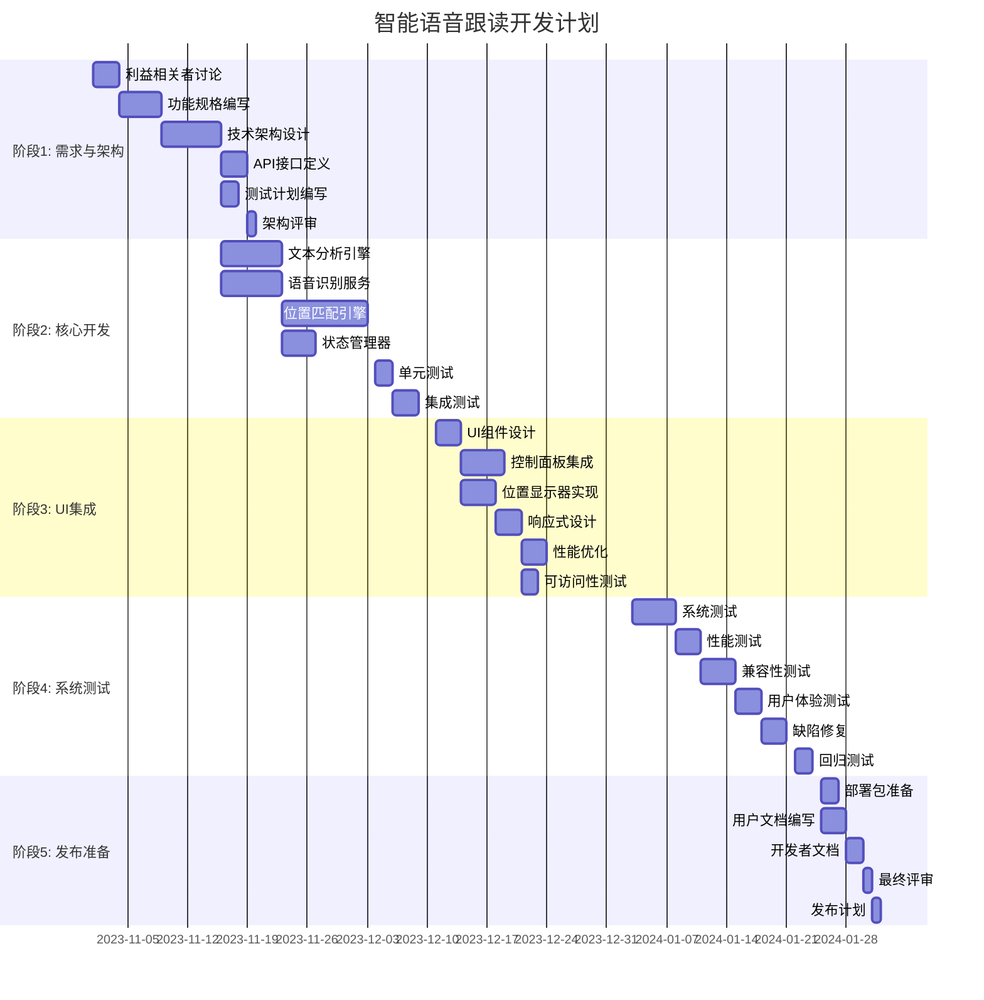

# 智能语音跟读功能开发迭代计划

## 1. 项目概述

本文档详细规划了智能语音跟读功能的开发迭代计划，包括时间表、资源分配、里程碑和风险管理。

## 2. 开发目标

### 2.1 主要目标

- 实现智能语音跟读核心功能（文本分析、语音识别、位置匹配）
- 提供流畅的用户体验（实时跟踪、跳句处理、重复朗读支持）
- 确保系统稳定性和性能（响应时间、资源使用）
- 完成全面测试和文档编写

### 2.2 成功标准

- 所有P0缺陷修复
- 性能指标达到设计要求
- 用户满意度>85%
- 文档完整且准确

## 3. 开发阶段划分

### 3.1 阶段1：需求确认与架构设计（2周）

**时间**: [起始日期] - [结束日期]
**目标**: 完成功能规格、技术架构和API设计

| 任务 | 责任人 | 时间估计 | 交付物 |
|------|--------|----------|--------|
| 利益相关者讨论 | 项目经理 | 3天 | 会议纪要 |
| 功能规格编写 | 业务分析师 | 5天 | 功能规格说明书 |
| 技术架构设计 | 架构师 | 7天 | 技术架构文档 |
| API接口定义 | 后端开发 | 3天 | API接口文档 |
| 测试计划编写 | 测试经理 | 2天 | 测试计划 |
| 架构评审 | 全团队 | 1天 | 评审报告 |

### 3.2 阶段2：核心模块开发（4周）

**时间**: [起始日期] - [结束日期]
**目标**: 完成文本分析、语音识别和位置匹配引擎

| 模块 | 责任人 | 时间估计 | 交付物 |
|------|--------|----------|--------|
| 文本分析引擎 | 后端开发 | 7天 | 文本分析组件 |
| 语音识别服务 | 前端开发 | 7天 | 语音识别组件 |
| 位置匹配引擎 | 算法工程师 | 10天 | 位置匹配组件 |
| 状态管理器 | 全栈开发 | 4天 | 状态管理组件 |
| 单元测试 | 开发人员 | 2天 | 单元测试报告 |
| 集成测试 | 测试工程师 | 3天 | 集成测试报告 |

### 3.3 阶段3：UI集成与优化（2周）

**时间**: [起始日期] - [结束日期]
**目标**: 完成用户界面集成和性能优化

| 任务 | 责任人 | 时间估计 | 交付物 |
|------|--------|----------|--------|
| UI组件设计 | UI设计师 | 3天 | 设计稿 |
| 控制面板集成 | 前端开发 | 5天 | 控制面板组件 |
| 位置显示器实现 | 前端开发 | 4天 | 位置显示组件 |
| 响应式设计 | 前端开发 | 3天 | 响应式布局 |
| 性能优化 | 性能工程师 | 3天 | 优化报告 |
| 可访问性测试 | QA工程师 | 2天 | 可访问性报告 |

### 3.4 阶段4：系统测试与验证（2周）

**时间**: [起始日期] - [结束日期]
**目标**: 完成系统测试和用户验证

| 测试类型 | 责任人 | 时间估计 | 交付物 |
|----------|--------|----------|--------|
| 系统测试 | 测试团队 | 5天 | 系统测试报告 |
| 性能测试 | 性能工程师 | 3天 | 性能测试报告 |
| 兼容性测试 | 测试工程师 | 4天 | 兼容性测试报告 |
| 用户体验测试 | UX团队 | 3天 | 用户反馈报告 |
| 缺陷修复 | 开发团队 | 3天 | 缺陷修复报告 |
| 回归测试 | 测试工程师 | 2天 | 回归测试报告 |

### 3.5 阶段5：发布准备（1周）

**时间**: [起始日期] - [结束日期]
**目标**: 完成发布准备和文档编写

| 任务 | 责任人 | 时间估计 | 交付物 |
|------|--------|----------|--------|
| 部署包准备 | DevOps工程师 | 2天 | 部署包 |
| 用户文档编写 | 技术作家 | 3天 | 用户手册 |
| 开发者文档 | 技术作家 | 2天 | API文档 |
| 发布检查表 | 项目经理 | 1天 | 检查表 |
| 最终评审 | 全团队 | 1天 | 评审报告 |
| 发布计划 | 项目经理 | 1天 | 发布计划 |

## 4. 详细时间表



## 5. 资源分配

### 5.1 团队结构

| 角色 | 人数 | 责任 |
|------|------|------|
| 项目经理 | 1 | 整体协调、进度管理 |
| 业务分析师 | 1 | 需求分析、文档编写 |
| 架构师 | 1 | 技术架构、关键决策 |
| 前端开发 | 2 | UI实现、集成 |
| 后端开发 | 2 | 核心算法、API |
| 全栈开发 | 1 | 模块开发、集成 |
| 测试工程师 | 2 | 测试执行、质量保证 |
| 性能工程师 | 1 | 性能优化、监控 |
| UX设计师 | 1 | 用户体验、界面设计 |
| DevOps工程师 | 1 | 部署、CI/CD |
| 技术作家 | 1 | 文档编写 |

### 5.2 工时估算

| 阶段 | 总工时 | 前端 | 后端 | 测试 | 其他 |
|------|--------|------|------|------|------|
| 阶段1 | 21人日 | 0 | 5 | 2 | 14 |
| 阶段2 | 33人日 | 7 | 14 | 5 | 7 |
| 阶段3 | 20人日 | 12 | 2 | 3 | 3 |
| 阶段4 | 20人日 | 2 | 3 | 12 | 3 |
| 阶段5 | 10人日 | 1 | 1 | 2 | 6 |
| **总计** | **104人日** | **22** | **25** | **24** | **33** |

## 6. 里程碑与交付物

### 6.1 主要里程碑

| 里程碑 | 日期 | 交付物 | 成功标准 |
|--------|------|--------|----------|
| 架构评审完成 | [日期] | 技术架构文档、API接口文档 | 架构通过评审 |
| 核心功能完成 | [日期] | 可运行原型、单元测试报告 | 所有核心模块通过单元测试 |
| UI集成完成 | [日期] | 可测试版本、集成测试报告 | 所有功能集成完成 |
| 系统测试通过 | [日期] | 完整测试报告 | 所有P0缺陷修复 |
| 发布准备完成 | [日期] | 部署包、完整文档 | 所有交付物准备就绪 |

### 6.2 交付物清单

| 类别 | 交付物 | 责任人 | 交付时间 |
|------|--------|--------|----------|
| 文档 | 功能规格说明书 | 业务分析师 | 阶段1结束 |
| 文档 | 技术架构文档 | 架构师 | 阶段1结束 |
| 文档 | API接口文档 | 后端开发 | 阶段1结束 |
| 文档 | 测试计划 | 测试经理 | 阶段1结束 |
| 代码 | 文本分析组件 | 后端开发 | 阶段2结束 |
| 代码 | 语音识别组件 | 前端开发 | 阶段2结束 |
| 代码 | 位置匹配组件 | 算法工程师 | 阶段2结束 |
| 代码 | 状态管理组件 | 全栈开发 | 阶段2结束 |
| 报告 | 单元测试报告 | 开发人员 | 阶段2结束 |
| 报告 | 集成测试报告 | 测试工程师 | 阶段2结束 |
| 代码 | 控制面板组件 | 前端开发 | 阶段3结束 |
| 代码 | 位置显示组件 | 前端开发 | 阶段3结束 |
| 报告 | 优化报告 | 性能工程师 | 阶段3结束 |
| 报告 | 可访问性报告 | QA工程师 | 阶段3结束 |
| 报告 | 系统测试报告 | 测试团队 | 阶段4结束 |
| 报告 | 性能测试报告 | 性能工程师 | 阶段4结束 |
| 报告 | 兼容性测试报告 | 测试工程师 | 阶段4结束 |
| 报告 | 用户反馈报告 | UX团队 | 阶段4结束 |
| 报告 | 缺陷修复报告 | 开发团队 | 阶段4结束 |
| 报告 | 回归测试报告 | 测试工程师 | 阶段4结束 |
| 部署 | 部署包 | DevOps工程师 | 阶段5结束 |
| 文档 | 用户手册 | 技术作家 | 阶段5结束 |
| 文档 | API文档 | 技术作家 | 阶段5结束 |
| 文档 | 发布计划 | 项目经理 | 阶段5结束 |

## 7. 风险管理

### 7.1 风险识别

| 风险ID | 风险描述 | 可能性 | 影响 | 缓解策略 | 责任人 |
|--------|----------|--------|------|----------|--------|
| R-001 | 语音识别准确性不足 | 中 | 高 | 实现备用识别服务，提供手动校正 | 后端开发 |
| R-002 | 位置匹配性能不足 | 低 | 中 | 优化算法，实现缓存机制 | 算法工程师 |
| R-003 | 浏览器兼容性问题 | 高 | 中 | 使用特性检测，实现降级方案 | 前端开发 |
| R-004 | 内存使用过高 | 低 | 中 | 优化数据结构，实现定期清理 | 性能工程师 |
| R-005 | 项目进度延误 | 中 | 高 | 定期进度评审，调整资源分配 | 项目经理 |
| R-006 | 团队成员变动 | 低 | 中 | 知识共享，文档完善 | 项目经理 |
| R-007 | 第三方API变更 | 低 | 中 | 实现适配器模式，降低耦合 | 架构师 |

### 7.2 风险应对计划

**高风险应对**:

1. **浏览器兼容性问题 (R-003)**
   - 提前进行兼容性测试
   - 实现特性检测和降级方案
   - 为常见浏览器提供专用优化

2. **项目进度延误 (R-005)**
   - 每周进度评审会议
   - 关键路径任务优先分配资源
   - 并行开发非依赖模块

**中风险应对**:

1. **语音识别准确性不足 (R-001)**
   - 实现多种识别服务适配器
   - 提供用户手动校正功能
   - 收集用户反馈持续优化

2. **团队成员变动 (R-006)**
   - 定期知识共享会议
   - 完善技术文档和注释
   - 交叉培训关键技能

**低风险监控**:

1. **位置匹配性能不足 (R-002)**
   - 定期性能评审
   - 监控生产环境性能
   - 根据反馈进行优化

2. **第三方API变更 (R-007)**
   - 监控API更新公告
   - 实现适配器模式降低耦合
   - 维护备用实现方案

## 8. 质量保证

### 8.1 质量标准

| 类别 | 标准 | 测量方法 |
|------|------|----------|
| 代码质量 | 单元测试覆盖率>80% | 测试覆盖率报告 |
| 代码质量 | 代码审查通过率100% | 代码审查记录 |
| 性能 | 文本分析时间<500ms | 性能测试报告 |
| 性能 | 位置匹配时间<50ms | 性能测试报告 |
| 兼容性 | 支持所有目标浏览器 | 兼容性测试报告 |
| 用户体验 | 任务完成率>90% | 用户测试报告 |
| 可靠性 | 无致命缺陷 | 缺陷跟踪系统 |
| 可靠性 | 严重缺陷修复率100% | 缺陷跟踪系统 |

### 8.2 质量控制活动

| 活动 | 频率 | 责任人 | 输出 |
|------|------|--------|------|
| 代码审查 | 每次提交 | 开发团队 | 审查报告 |
| 单元测试 | 每日构建 | 开发人员 | 测试报告 |
| 集成测试 | 每周 | 测试工程师 | 测试报告 |
| 性能评审 | 每两周 | 性能工程师 | 评审报告 |
| 进度评审 | 每周 | 项目经理 | 进度报告 |
| 风险评估 | 每两周 | 项目经理 | 风险报告 |
| 用户反馈评审 | 每月 | UX团队 | 反馈报告 |

## 9. 变更管理

### 9.1 变更控制流程

```
[变更请求] → [影响分析] → [变更评审] → [批准/拒绝]
                     ↓
                 [实施计划] → [实施变更] → [验证] → [关闭]
```

### 9.2 变更分类

| 类别 | 描述 | 审批流程 |
|------|------|----------|
| 重大变更 | 影响架构或核心功能 | 项目经理+架构师+利益相关者 |
| 中等变更 | 影响模块接口或性能 | 项目经理+技术负责人 |
| 微小变更 | 内部实现优化 | 技术负责人 |

### 9.3 变更请求模板

```markdown
## 变更请求

**变更ID**: [自动生成]
**请求人**: [姓名]
**请求日期**: [日期]
**优先级**: [高/中/低]

### 变更描述
[详细描述变更内容和原因]

### 影响分析
**受影响组件**:
- [组件1]
- [组件2]

**受影响功能**:
- [功能1]
- [功能2]

**风险评估**:
- [风险1]
- [风险2]

### 实施计划
**实施步骤**:
1. [步骤1]
2. [步骤2]
3. [步骤3]

**时间估计**: [X]人日
**资源需求**: [描述]

### 验证计划
**验证方法**:
- [测试方法1]
- [测试方法2]

**回滚计划**:
- [回滚步骤1]
- [回滚步骤2]

### 批准
**批准人**: [姓名]
**批准日期**: [日期]
**批准意见**: [同意/拒绝/修改后同意]
```

## 10. 发布计划

### 10.1 发布前检查表

| 检查项 | 责任人 | 状态 |
|--------|--------|------|
| 所有P0缺陷已修复 | 测试经理 | [ ] |
| 所有文档已完成 | 技术作家 | [ ] |
| 部署包已准备 | DevOps工程师 | [ ] |
| 用户培训材料已准备 | 培训专员 | [ ] |
| 监控系统已就绪 | DevOps工程师 | [ ] |
| 客服准备就绪 | 客服经理 | [ ] |
| 发布公告已准备 | 市场经理 | [ ] |
| 回滚计划已确认 | 项目经理 | [ ] |

### 10.2 发布步骤

| 步骤 | 责任人 | 预计时间 | 依赖项 |
|------|--------|----------|--------|
| 最终代码冻结 | 项目经理 | 1天 | 所有测试通过 |
| 部署包构建 | DevOps工程师 | 2小时 | 代码冻结 |
| 部署到预发布环境 | DevOps工程师 | 1小时 | 部署包 |
| 预发布验证 | 测试团队 | 4小时 | 部署完成 |
| 发布公告发布 | 市场经理 | 1小时 | 验证通过 |
| 部署到生产环境 | DevOps工程师 | 1小时 | 公告发布 |
| 监控系统启动 | DevOps工程师 | 30分钟 | 部署完成 |
| 用户支持就绪 | 客服经理 | 30分钟 | 部署完成 |
| 发布后评审 | 项目经理 | 2小时 | 运行24小时 |

### 10.3 回滚计划

**回滚触发条件**:
- 致命缺陷影响核心功能
- 严重性能问题影响用户体验
- 安全漏洞被发现
- 用户反馈大量负面

**回滚步骤**:

1. **紧急响应** (30分钟内)
   - 暂停新用户访问
   - 通知所有利益相关者
   - 激活回滚团队

2. **问题诊断** (1小时内)
   - 分析监控数据
   - 确认问题根源
   - 评估影响范围

3. **回滚执行** (2小时内)
   - 回滚到上一个稳定版本
   - 验证回滚成功
   - 更新状态监控

4. **事后处理** (回滚后24小时内)
   - 根因分析
   - 修复计划制定
   - 用户沟通
   - 重新发布计划

## 11. 成功标准与验收

### 11.1 发布成功标准

- [ ] 所有P0缺陷已修复
- [ ] 所有核心功能正常工作
- [ ] 性能指标达到设计要求
- [ ] 兼容性测试通过
- [ ] 用户反馈积极
- [ ] 无重大安全问题
- [ ] 文档完整且准确

### 11.2 验收检查表

| 检查项 | 责任人 | 状态 |
|--------|--------|------|
| 功能验收 | 测试经理 | [ ] |
| 性能验收 | 性能工程师 | [ ] |
| 安全验收 | 安全工程师 | [ ] |
| 文档验收 | 技术作家 | [ ] |
| 用户验收 | UX经理 | [ ] |
| 运营验收 | 运营经理 | [ ] |
| 最终批准 | 项目经理 | [ ] |

## 12. 附录

### 12.1 术语表

| 术语 | 定义 |
|------|------|
| VTR | Voice Tracking（语音跟踪） |
| NLP | Natural Language Processing（自然语言处理） |
| API | Application Programming Interface（应用程序编程接口） |
| UX | User Experience（用户体验） |
| QA | Quality Assurance（质量保证） |
| DevOps | Development and Operations（开发与运维） |
| CI/CD | Continuous Integration/Continuous Deployment（持续集成/持续部署） |

### 12.2 参考文档

- 功能规格说明书
- 技术架构文档
- API接口文档
- 测试计划
- 用户手册

### 12.3 变更历史

| 版本 | 日期 | 变更描述 | 变更人 |
|------|------|----------|--------|
| 1.0 | [日期] | 初始版本 | [姓名] |
| 1.1 | [日期] | 更新时间表 | [姓名] |
| 1.2 | [日期] | 调整资源分配 | [姓名] |

本文档提供了智能语音跟读功能的完整开发迭代计划，可作为项目团队的执行指南和进度跟踪参考。